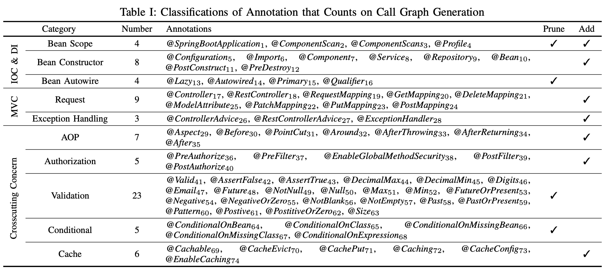

## AnnHancer

Web applications serve billions of clients across various business domains. Spring has dominated web applications with developer-friendly programming features to ease web development, which creates an eager need of static analysis to detect bugs and vulnerabilities in Spring web applications. Call graph generation is the foundation of inter-procedural static analysis. However, to the best of our knowledge, no previous call graph generation approach supports the feature of annotations which are commonly used in Spring web applications. Fortunately, Spring annotations contain valuable semantics that can help enhance call graph generation.

In this paper, we first conduct an in-depth empirical study on 104 annotations, and find that 74 annotations in three categories can be used to enhance call graph generation via adding missing calls or pruning spurious calls. Inspired by our study, we then propose **AnnHancer** to enhance call graph with the help of annotation usages. Experiments on 10 Spring web applications have demonstrated that **AnnHancer** can add 229 direct missing calls and prune 58 direct spurious calls for a project with high accuracy.

The paper has been submitted to ICSE 2023.

## Annotation

* list of [Spring guides](spring-guide.txt).

<!-- * list of analyzed [jar files](jars.txt). -->

* list of [104 annotations](annotation.json).

* list of 74 annotations.

   


## Problematic Method

This page lists the problematic methods whose children methods are either missing or spurious.

#### Bean Constructor

**Jar:** org.springframework:spring-beans:5.3.22

**Method:**

```java
package org.springframework.beans;

public abstract class BeanUtils{
    public static <T> T instantiate(Class<T> clazz) throws BeanInstantiationException {
        Assert.notNull(clazz, "Class must not be null");
        if (clazz.isInterface()) {
            throw new BeanInstantiationException(clazz, "Specified class is an interface");
        } else {
            try {
                return clazz.newInstance();
            } catch (InstantiationException var2) {
                throw new BeanInstantiationException(clazz, "Is it an abstract class?", var2);
            } catch (IllegalAccessException var3) {
                throw new BeanInstantiationException(clazz, "Is the constructor accessible?", var3);
            }
        }
    }
}
```


#### MVC Request and MVC Exception

**Jar:** org.springframework:spring-web:5.3.22

**Method:**

```java
 protected Object doInvoke(Object... args) throws Exception {
        Method method = this.getBridgedMethod();

        try {
            return KotlinDetector.isSuspendingFunction(method) ? CoroutinesUtils.invokeSuspendingFunction(method, this.getBean(), args) : method.invoke(this.getBean(), args);
        } catch (IllegalArgumentException var5) {
            this.assertTargetBean(method, this.getBean(), args);
            String text = var5.getMessage() != null ? var5.getMessage() : "Illegal argument";
            throw new IllegalStateException(this.formatInvokeError(text, args), var5);
        } catch (InvocationTargetException var6) {
            Throwable targetException = var6.getTargetException();
            if (targetException instanceof RuntimeException) {
                throw (RuntimeException)targetException;
            } else if (targetException instanceof Error) {
                throw (Error)targetException;
            } else if (targetException instanceof Exception) {
                throw (Exception)targetException;
            } else {
                throw new IllegalStateException(this.formatInvokeError("Invocation failure", args), targetException);
            }
        }
    }
```


#### AOP

**Jar:** org.springframework:spring-aop:5.3.22

**Method:** 

```java
 protected Object invokeAdviceMethodWithGivenArgs(Object[] args) throws Throwable {
        Object[] actualArgs = args;
        if (this.aspectJAdviceMethod.getParameterCount() == 0) {
            actualArgs = null;
        }

        try {
            ReflectionUtils.makeAccessible(this.aspectJAdviceMethod);
            return this.aspectJAdviceMethod.invoke(this.aspectInstanceFactory.getAspectInstance(), actualArgs);
        } catch (IllegalArgumentException var4) {
            throw new AopInvocationException("Mismatch on arguments to advice method [" + this.aspectJAdviceMethod + "]; pointcut expression [" + this.pointcut.getPointcutExpression() + "]", var4);
        } catch (InvocationTargetException var5) {
            throw var5.getTargetException();
        }
    }
```


#### Conditional

**Jar:** org.springframework.boot:spring-boot-autoconfigure:2.7.3

**Method:**

```java
package org.springframework.boot.autoconfigure.condition;

public abstract class SpringBootCondition implements Condition {
    public abstract ConditionOutcome getMatchOutcome(ConditionContext context, AnnotatedTypeMetadata metadata);
}
```


#### Cache

**Jar:** org.springframework:spring-context:5.3.22

**Method:**

```java
    public Object invoke(final MethodInvocation invocation) throws Throwable {
        Method method = invocation.getMethod();
        CacheOperationInvoker aopAllianceInvoker = () -> {
            try {
                return invocation.proceed();
            } catch (Throwable var2) {
                throw new ThrowableWrapper(var2);
            }
        };
        Object target = invocation.getThis();
        Assert.state(target != null, "Target must not be null");

        try {
            return this.execute(aopAllianceInvoker, target, method, invocation.getArguments());
        } catch (ThrowableWrapper var6) {
            throw var6.getOriginal();
        }
    }
```


#### Validation

**Jar:** org.hibernate.validator:hibernate-validator:6.2.3.Final

**Method:**

```java
package org.hibernate.validator.internal.engine.constraintvalidation;

public abstract class ConstraintTree<A extends Annotation> {
       protected final <V> Optional<ConstraintValidatorContextImpl> validateSingleConstraint(ValueContext<?, ?> valueContext, ConstraintValidatorContextImpl constraintValidatorContext, ConstraintValidator<A, V> validator) {
        boolean isValid;
        try {
            V validatedValue = valueContext.getCurrentValidatedValue();
            isValid = validator.isValid(validatedValue, constraintValidatorContext);
        } catch (RuntimeException var6) {
            if (var6 instanceof ConstraintDeclarationException) {
                throw var6;
            }
            throw LOG.getExceptionDuringIsValidCallException(var6);
        }
        return !isValid ? Optional.of(constraintValidatorContext) : Optional.empty();
    }
}
```


## Source

The source of ANNHANCER could be retrieved [here](AnnHancer.tar). It starts from  ``Main/handlerMain.java`` while ``Main/IModule.java`` and ``Main/Module.java`` uses annotations from 10 categories to enhance existing call graph generation methods, respectively.


## Evaluation Result


* RQ1 [Annotation prevalence](prevalence.zip)
* RQ2 [Effectiveness evaluation](effectiveness.zip)
* RQ3 [Accuracy evaluation](accuracy.zip)
* RQ4 [Performance](performance.zip)


